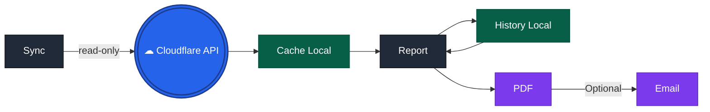

# 🔒 Security Guide for Cloudflare Executive Report

This document explains how to securely configure and use the Cloudflare Executive Report tool.

---

## 🎯 Core Security Principles

| Principle               | Implementation                   |
| ----------------------- | -------------------------------- |
| **Read-only by design** | Never requires write permissions |
| **Local-first**         | All data stored on your machine  |
| **Open source**         | Full code transparency           |
| **No telemetry**        | Zero external data transmission  |

---

## 🔐 API Token Permissions (Most Important)

### ✅ Minimal Required Permissions

Run `cf-report validate` to check your token:

```bash
cf-report validate
```

**Expected output:**

```
Validating token permissions (9 checks)...
Zone used for zone-scoped probes: zone_id_abc123

Permission                                      Status          Used By                       Notes
-------------------------------------------------------------------------------------------------------
Zone > Zone Read                                OK              dns, http, cache, security, http_adaptive, dns_records, certificates, zone_health
Zone > Analytics Read                           OK              dns, http, cache, security, http_adaptive
Zone > DNS Read                                 OK              dns_records, zone_health
Zone > SSL and Certificates Read                OK              certificates, zone_health
Zone > Zone Settings Read                       OK              zone_health
Zone > Firewall Services Read                   OK              zone_health
Zone > WAF Read                                 OK              zone_health
Account > Access: Audit Logs Read               OK              audit
Account > Account Settings Read                 OK              audit

Result: 9 OK  |  0 MISSING  |  0 SKIPPED
All required permissions are available.
```

### ❌ What We DON'T Need (Write Permissions)

If your token has write permissions, `cf-report validate` will show:

```
!!!!!!!!!!!!!!!!!!!!!!!!!!!!!!!!!!!!!!!!!!!!!!!!!!!!!!!!!!!!!!!!!!!!!!!!!!!!!!!!
            SECURITY WARNING: UNWANTED WRITE PERMISSIONS DETECTED.
      Your API token appears to have WRITE access to your Cloudflare zone.
      This tool only requires READ permissions. For better security, it is
       strongly recommended to restrict this token to 'Read' access only.
!!!!!!!!!!!!!!!!!!!!!!!!!!!!!!!!!!!!!!!!!!!!!!!!!!!!!!!!!!!!!!!!!!!!!!!!!!!!!!!!
```

### 🛠️ How to Create a Secure Token in Cloudflare Dashboard

1. Go to **Cloudflare Dashboard** → **Manage Account** → **Account API Tokens**
2. Click **Create Token** → **Custom Token**
3. **Token name**: `executive-report-readonly`
4. **Permissions** (add each as **Read**):

| Category | Permission                | Required | What happens if missing?       |
| -------- | ------------------------- | -------- | ------------------------------ |
| Zone     | Zone Read                 | ✅       | Tool cannot function           |
| Zone     | Analytics Read            | ✅       | No traffic/security/cache data |
| Zone     | DNS Read                  | ⚠️       | DNS section shows unavailable  |
| Zone     | SSL and Certificates Read | ⚠️       | Certificate expiry unknown     |
| Zone     | Zone Settings Read        | ⚠️       | SSL/HSTS status unknown        |
| Zone     | Firewall Services Read    | ⚠️       | Firewall metrics missing       |
| Zone     | WAF Read                  | ⚠️       | WAF status unknown             |
| Account  | Access: Audit Logs Read   | ℹ️       | Validation less detailed       |
| Account  | Account Settings Read     | ℹ️       | Validation less detailed       |

> **Note**: ✅ = Required | ⚠️ = Recommended if you use it | ℹ️ = Nice-to-have for full features

5. **Zone Resources**: Select "Specific Domains" or "All Domains".
6. **Client IP Address Filtering** (optional): Restrict to your office/VPN IP
7. **TTL**: Set reasonable expiration (90 days recommended)
8. Click **Review token** → **Create Token**

> ⚠️ **Important**: Copy the token immediately. Cloudflare only shows it once.

---

## 📁 What Data Is Stored Locally

The tool caches all data in `~/.cf-report/cache/`. **No data leaves your machine.**

### Cache Structure

```
~/.cf-report/
├── cache/
│   └── {zone_id}/
│       └── {date}/
│           ├── audit.json             # Audit events (WAF rules, logins, etc.)
│           ├── cache.json             # Cache performance
│           ├── certificates.json      # SSL/TLS certificates
│           ├── dns.json               # DNS queries
│           ├── dns_records.json       # DNS records
│           ├── http.json              # HTTP traffic
│           ├── http_adaptive.json     # HTTP adaptive performance
│           └── security.json          # Security events (WAF/bot mitigations)
├── history/
│   └── report_2026-04-21.json       # Previous report data (used for comparisons between periods)
└── config.yaml                      # Your config
```

### Sample Cached Data Example

```json
{
  "_schema_version": 1,
  "_source": "api",
  "_source_timestamp": "2026-04-04T12:00:00Z",
  "data": {
    "date": "2026-04-01",
    "requests": 45200,
    "cached_requests": 1200,
    "mitigated_count": 865,
    "country_map": [{ "clientCountryName": "US", "requests": 30000 }]
  }
}
```

> See [`docs/sample-data/cache/`](docs/sample-data/cache/) for complete examples.

---

## 🔄 Data Flow (No Data Leaves Your Control)



- ✅ **All API calls** are read-only HTTPS requests
- ✅ **All cached data** stays in `~/.cf-report/`
- ✅ **No telemetry** - the tool never phones home
- ✅ **No external storage** - no S3, no cloud databases
- ✅ **No analytics collection** - your usage isn't tracked

---

## 🧪 Validate Your Setup

### Quick Security Check

```bash
# 1. Create a config with a zone (or use existing config.yaml)
cf-report init

# 2. Validate token permissions
cf-report validate

# 3. Sync data from Cloudflare API/GraphQL (this will create the cache files locally)
cf-report sync

# 4. Verify no network connections after sync and run offline reports
cf-report report -o test.pdf
```

---

## 🚫 What We DON'T Do

| Activity                           | Status | Evidence                                                                                      |
| ---------------------------------- | ------ | --------------------------------------------------------------------------------------------- |
| Send data to external servers      | ❌     | [Code search](https://github.com/vhsantos/cloudflare-executive-report/search?q=requests.post) |
| Store tokens in plaintext globally | ❌     | Token only in your local config                                                               |
| Collect usage analytics            | ❌     | No analytics libraries in dependencies                                                        |
| Require internet after sync        | ❌     | Generate reports offline                                                                      |
| Execute remote code                | ❌     | Pure Python package                                                                           |

---

## 📊 Security Recommendations

### For Production Deployments

```yaml
# ~/.cf-report/config.yaml
api_token: "${CF_REPORT_API_TOKEN}" # Use env var, NOT hardcoded
cache_dir: "/secure/encrypted/path" # Use encrypted volume
log_level: "warning" # Reduce sensitive output

# Use zone-scoped tokens when possible
zones:
  - id: "abc123..." # Instead of "all zones"
```

### CI/CD Security

```bash
# GitHub Actions example - NEVER log tokens!
env:
  CF_REPORT_API_TOKEN: ${{ secrets.CF_REPORT_API_TOKEN }}

run: |
  cf-report sync --last 30
  cf-report report -o report.pdf
  # Cache is ephemeral - clean up
  cf-report clean --older-than 1
```

### Regular Maintenance

```bash
# Rotate tokens every 90 days
cf-report validate  # Check expiry

# Clean old cached data
cf-report clean --older-than 90

# Audit what's cached
ls -la ~/.cf-report/cache/*/
```

---

## 🔍 Verify the Code Yourself

All code is open source:

```bash
git clone https://github.com/vhsantos/cloudflare-executive-report.git
cd cloudflare-executive-report

# Check for network calls
grep -r "requests\.post\|urllib\.request" src/

# Check for write operations beyond cache
grep -r "open\(.*w\)" src/ | grep -v "cache\|history"

# Review token handling
grep -r "api_token\|CF_REPORT" src/
```

---

## ✅ Security Checklist

Before deploying, verify:

- [ ] `cf-report validate` shows **0 MISSING**, **0 WRITE**
- [ ] API token has expiration date < 90 days
- [ ] `~/.cf-report/` is on encrypted storage
- [ ] Config file has `chmod 600` permissions
- [ ] Token is in environment variable, not hardcoded
- [ ] Cache is cleaned periodically
- [ ] No read-write tokens used
- [ ] Read-only token is NOT used elsewhere

---

## 📚 Related Documentation

- [Cloudflare API Token Best Practices](https://developers.cloudflare.com/fundamentals/api/get-started/create-token/)
- [Principle of Least Privilege](https://en.wikipedia.org/wiki/Principle_of_least_privilege)
- [User Guide](docs/USAGE.md) - Full CLI reference

---

⬅️ [Back to README](README.md)
