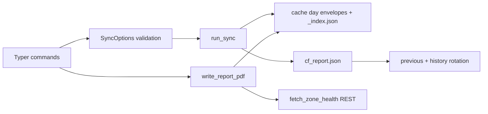
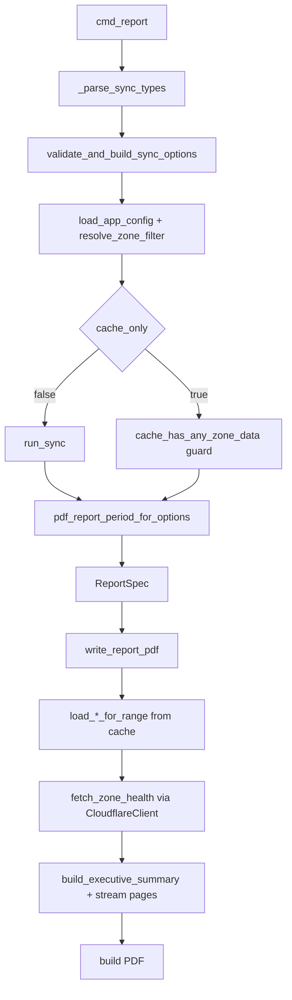
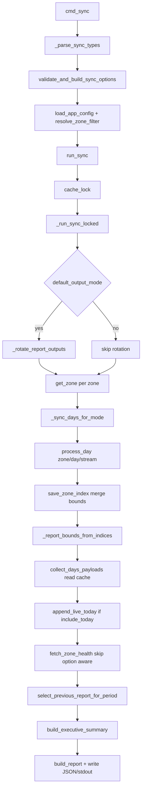
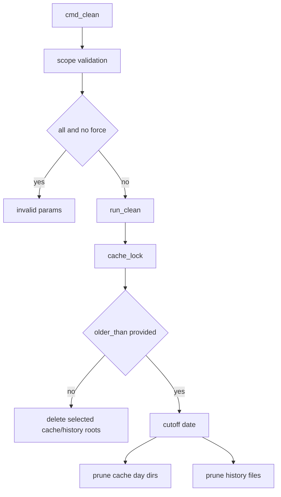
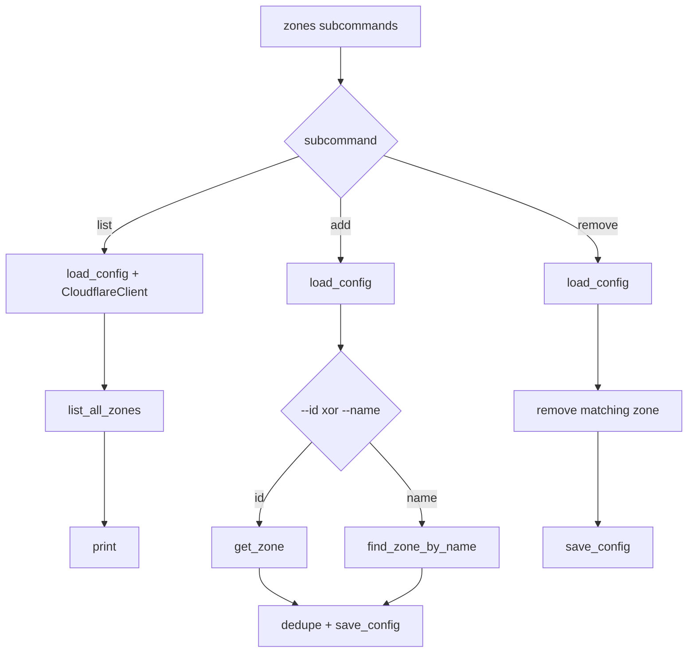
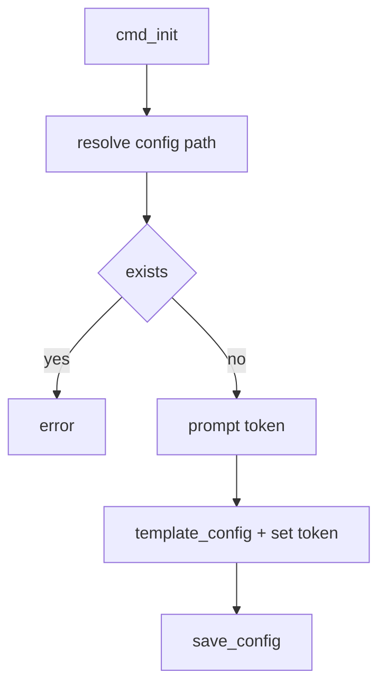

# CLI Command Flows (Full Source Evaluation)

Built from all files under `src`.

## Source Map

- CLI: `src/cloudflare_executive_report/cli.py`
- CLI validation: `src/cloudflare_executive_report/cli_common.py`
- Sync core: `src/cloudflare_executive_report/sync/orchestrator.py`
- Day processing: `src/cloudflare_executive_report/sync/day_processor.py`
- Fetchers registry/protocol: `src/cloudflare_executive_report/fetchers/registry.py`, `src/cloudflare_executive_report/fetchers/types.py`
- Fetchers implementations: `src/cloudflare_executive_report/fetchers/*.py`
- Cache files/index/lock: `src/cloudflare_executive_report/cache/*.py`
- Aggregation: `src/cloudflare_executive_report/aggregate.py`
- Executive rules/summary: `src/cloudflare_executive_report/executive/*.py`
- PDF build: `src/cloudflare_executive_report/pdf/orchestrate.py`
- PDF cache loaders: `src/cloudflare_executive_report/pdf/loader.py`
- Zone health: `src/cloudflare_executive_report/zone_health.py`

## Runtime Architecture

## Compute report period for PDF (exact meaning)

Called by `cmd_report`:

- `pdf_report_period_for_options(cfg, sync_opts, zone_filter=...)`

Internal logic:

1. Resolve selected zones (by id/name or all).
2. Set `y = utc_yesterday()`.
3. Call `_report_bounds_from_indices(...)`:
   - semantic flags -> `_semantic_current_bounds`
   - `--last N` -> `last_n_complete_days`
   - `--start/--end` -> direct range
   - incremental -> scan zone `_index.json` earliest/latest for selected streams
4. If `--include-today`, force end date to `utc_today()`.
5. Return `(start, end)` for `ReportSpec`.

This is date-boundary computation only; no fetch on its own.

## `cf-report report` (exact flow)

### `report` side effects

- Cloudflare API
  - Non-cache-only: yes during sync for selected streams and `get_zone`.
  - Cache-only: PDF still calls `fetch_zone_health(..., skip=False)` currently.
- Cache writes
  - Non-cache-only: yes (`process_day`, `_index.json` updates).
  - Cache-only: none.
- JSON writes
  - Non-cache-only: yes (`cf_report.json` by default).
- Rotation writes
  - In sync default output mode: current copied to previous and history.
- PDF writes
  - always writes requested output path.

## `cf-report sync` (exact flow)

### `process_day` decision tree

- Outside retention -> write envelope `_source="null"` (no API call).
- Cache exists and not refresh and not error -> skip.
- Otherwise call fetcher API:
  - success -> `_source="api"`
  - rate limit -> `_source="error"` + retry-after
  - other API error -> `_source="error"`

## Stream-to-API mapping

- `dns`: GraphQL `dnsAnalyticsAdaptiveGroups`
- `http`: GraphQL `httpRequests1dGroups`
- `http_adaptive`: GraphQL `httpRequestsAdaptiveGroups`
- `security`: GraphQL `httpRequestsAdaptiveGroups`
- `cache`: GraphQL `httpRequestsAdaptiveGroups`
- `dns_records`: REST DNS records
- `audit`: REST account audit logs
- `certificates`: REST certificate packs

Registry order (`FETCHER_REGISTRY`) defines sync iteration and default `--types`.

## Baseline selection for comparisons

Function: `select_previous_report_for_period(...)`

Candidate set:

- `cf_report.previous.json`
- `outputs/history/cf_report_*.json`

Filter gates:

- parseable report period
- strict chronology (`candidate.end < current.start`)
- not same exact period
- same zone exists in candidate
- semantic mode: exact expected baseline bounds
- other modes: equal period length

Best candidate:

- most recent valid `period.end`.

## `cf-report clean` flow

No Cloudflare API calls in clean.

## `cf-report zones` commands

## `cf-report init` flow

