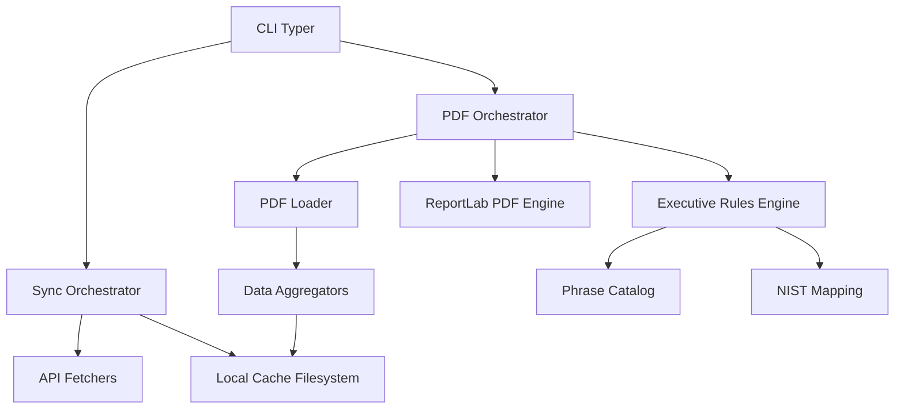
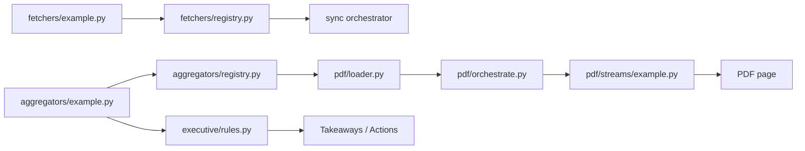

# Architecture: Cloudflare Executive Report

This document describes the high-level architecture and data flow of the
`cloudflare-executive-report` tool.

## Overview

The tool is a stateless CLI that fetches Cloudflare analytics data, caches it
locally in structured JSON, and aggregates it into Executive Reports (JSON and
PDF).

## Component Structure



### 1. Fetchers (`fetchers/`)

Each Cloudflare data stream (e.g. `http`, `security`, `cache`) has a dedicated
fetcher class. Fetchers implement the `Fetcher` protocol defined in
`fetchers/types.py` and are responsible for converting date ranges into
Cloudflare-specific API calls (REST or GraphQL via `CloudflareClient`).

All fetchers are registered in `fetchers/registry.py` (`FETCHER_REGISTRY`).
Registry insertion order defines the default sync and PDF section order.

### 2. Cache (`cache/`)

Data is cached per zone and per day:

```
~/.cache/cf-report/<zone_id>/<YYYY-MM-DD>/<stream>.json
```

Each file is an envelope: `{ "_source": "api" | "null" | "error", "data": {...} }`.

Incremental syncs and multi-period reports never re-fetch historical data.

### 3. Aggregators (`aggregators/`)

Aggregators take a list of daily `data` blobs (as stored by fetchers) and
reduce them into a single summary dict - summing totals, calculating ratios,
building top-N tables.

All builders are registered in `aggregators/registry.py` (`SECTION_BUILDERS`).
Keys in `FETCHER_REGISTRY` and `SECTION_BUILDERS` must match exactly.

### 4. PDF Loader (`pdf/loader.py`)

The loader reads day files from disk for a date range, calls the matching
aggregator, and returns a typed `*LoadResult` dataclass. Streams with chart
data expose extra fields (e.g. `daily_security_triple` for the timeseries).

### 5. Executive Rules (`executive/`)

Separated from data collection. The rules engine in `executive/rules.py`
evaluates aggregated metrics against thresholds and generates human-readable
"Takeaways" and "Actions" using the Phrase Catalog
(`executive/phrase_catalog.py`). NIST control mappings live in
`executive/nist_catalog.py`.

### 6. PDF Streams (`pdf/streams/`)

Each stream that renders a PDF page has a dedicated module. Each module exposes:

- `append_<stream>_stream(story, ...)` - appends ReportLab flowables.
- `collect_<stream>_appendix_notes(rollup, *, profile)` - optional appendix notes.

The PDF orchestrator (`pdf/orchestrate.py`) drives page assembly in registry
insertion order.

## Data Flow

### Sync Flow

1. User runs `cf-report sync`.
2. Orchestrator calculates missing days for each zone based on the local index.
3. Fetchers call Cloudflare API for each missing day.
4. Responses are wrapped in an envelope and saved to disk.

### Report Flow

1. User runs `cf-report report`.
2. (Optional) Sync missing days.
3. PDF loader reads cached files for the chosen period.
4. Aggregators build `current` and `previous` data blocks.
5. Rules engine compares `current` vs `previous` to find wins, risks, and deltas.
6. PDF Engine renders the report using ReportLab.

## Stream Lifecycle (adding a new stream)



See [`docs/developers/add-new-stream.md`](developers/add-new-stream.md) for
the step-by-step guide and the annotated skeleton at
`src/cloudflare_executive_report/fetchers/example.py`.
