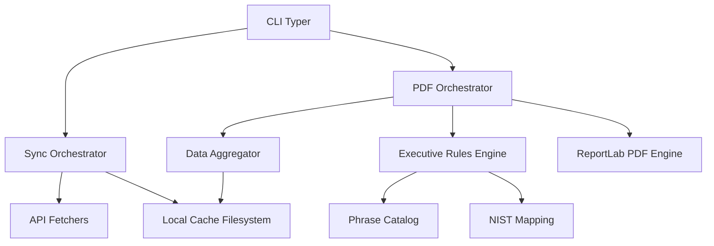

# Architecture: Cloudflare Executive Report

This document describes the high-level architecture and data flow of the `cloudflare-executive-report` tool.

## Overview

The tool is designed as a stateless CLI that interacts with the Cloudflare API to fetch analytics data, caches it locally in a structured JSON format, and aggregates it into "Executive Reports" (JSON and PDF).

## Component Structure

### 1. Fetchers (`fetchers/`)
Each Cloudflare data stream (e.g., `http`, `security`, `dns`) has a dedicated fetcher class. Fetchers are responsible for converting date ranges into Cloudflare-specific API calls (REST or GraphQL).

### 2. Cache (`cache/`)
Data is cached per zone and per day:
`~/.cache/cf-report/<zone_id>/<YYYY-MM-DD>/<stream>.json`
This allows for incremental syncs and multi-period reporting without re-fetching historical data.

### 3. Aggregators (`aggregators/`)
Aggregators take a list of daily JSON payloads and reduce them into a single summary for a given period (e.g., summing total requests, calculating 95th percentile latency).

### 4. Executive Rules (`executive/`)
The "Executive Summary" logic is separated from data collection. The Rules engine evaluates aggregated metrics against established thresholds (e.g., "Origin errors > 5%") and generates human-readable "Takeaways" and "Actions" using the Phrase Catalog.

## Data Flow

### Sync Flow
1. User runs `cf-report sync`.
2. Orchestrator calculates missing days for each zone based on the local index.
3. Fetchers call Cloudflare API for each missing day.
4. Responses are wrapped in an "Envelope" (metadata + data) and saved to disk.

### Report Flow
1. User runs `cf-report report`.
2. (Optional) Sync missing days.
3. Orchestrator selects the baseline period (e.g., same duration immediately preceding the current period).
4. Aggregators build the `current` and `previous` data blocks.
5. Rules engine compares `current` vs `previous` to find wins, risks, and deltas.
6. PDF Engine renders the report using ReportLab.
