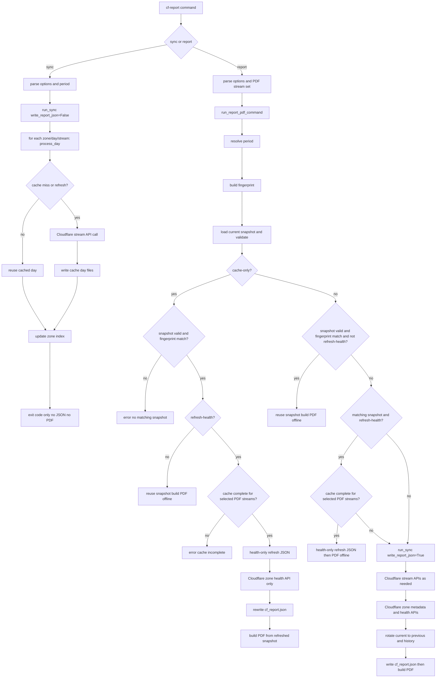

# Report and Sync Flow

Developer reference for command behavior, options, cache/history/output files,
and Cloudflare API calls.

## End-to-end flow (with options)

## Option behavior matrix

| Command | Stream API calls | Zone health API calls | Cache writes | JSON writes | PDF |
| --- | --- | --- | --- | --- | --- |
| `sync` | Yes, on cache miss or `--refresh` | No | Yes | No | No |
| `report` | Yes, only when it needs sync path | Yes, in sync path | Maybe | Yes | Yes |
| `report --cache-only` | No | No | No | No | Yes (snapshot reuse only) |
| `report --cache-only --refresh-health` | No | Yes (health only) | No | Yes | Yes |
| `report --refresh-health` | If cache incomplete for PDF streams, sync runs; otherwise no stream sync | Yes | Maybe | Yes | Yes |

## Files and history behavior

- **Cache files**
  - Path root: `cache/`
  - Written by `sync` and by report sync path.
  - Never deleted by report path.

- **Current report JSON**
  - Path: output `cf_report.json`
  - Written by report sync path and by health-only refresh path.
  - Contains fingerprint, report period, partial/missing days, and health timestamp.

- **Report history rotation**
  - On report sync path with default output mode:
    - old current is copied to `cf_report_previous.json`
    - old current is copied to `history/cf_report_<timestamp>.json`
  - Health-only refresh updates current JSON in place (no rotation).

## Cloudflare API call points

- **Stream APIs**: fetcher `process_day` path (`dns/http/security/cache/...`).
- **Zone metadata API**: `get_zone` for each selected zone in sync/refresh paths.
- **Zone health API**: `fetch_zone_health`.
- **No stream API in `--cache-only --refresh-health`** path.

## Source modules

- Main report decision tree: `report/command_flow.py`
- Health-only refresh: `report/health_refresh.py`
- Baseline selection: `report/baseline_selection.py`
- Snapshot IO: `report/snapshot.py`
- Cache completeness helpers: `common/report_cache.py`
- Period bounds helpers: `common/report_period.py`
