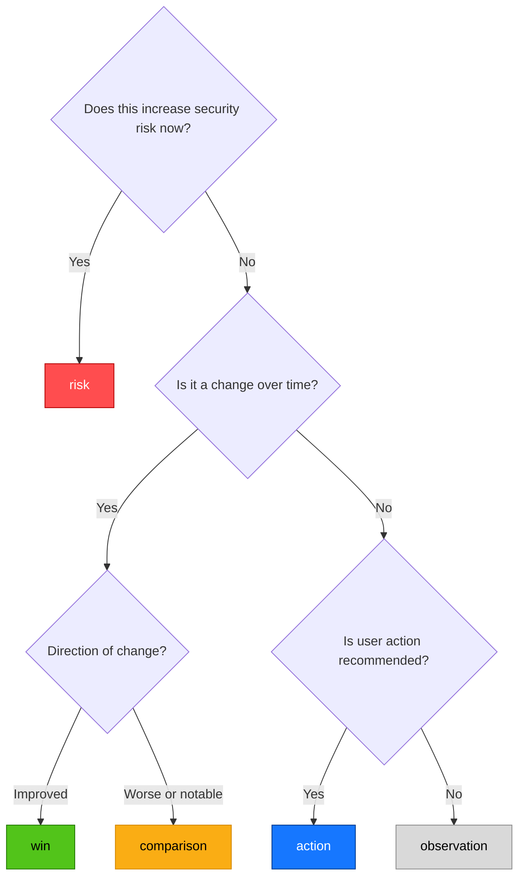

# Security Score & Phrase Catalog Guide (For Developers)

## Overview

The executive summary generates security posture takeaways using a state-based phrase catalog. Each phrase has a `state` that determines:

- Whether it affects the security score
- Where it appears in the report (risks, wins, signals, deltas, actions)

---

## Phrase States (5 Types)

| State         | Purpose                         | Affects Score? | Section in Report |
| ------------- | ------------------------------- | -------------- | ----------------- |
| `risk`        | Something bad that needs fixing | ✅ Yes         | `risks`           |
| `win`         | Something that improved         | ❌ No          | `wins`            |
| `action`      | Recommended next step           | ❌ No          | `actions`         |
| `comparison`  | Change vs previous period       | ❌ No          | `deltas`          |
| `observation` | Neutral fact, not good or bad   | ❌ No          | `signals`         |

---

## When to Use Each State

### Use `risk` when

- The condition is **clearly bad** for security
- A CTO would say "fix this"
- Example: "WAF disabled", "SSL mode Off", "Certificate expires in 14 days"

### Use `win` when

- Something **improved** compared to previous period
- The change is **positive** for security
- Example: "DNSSEC now active", "Apex record now proxied"

### Use `action` when

- You want to **recommend a next step**
- The action is not tied to a specific risk (or complements one)
- Example: "Enable DNSSEC", "Review WAF rules"

### Use `comparison` when

- Showing a **change between periods**
- Not judging if good or bad (just stating the delta)
- Example: "Traffic growth: 15% increase", "Cache efficiency dropped: 8%"

### Use `observation` when

- The condition is **neutral** (not clearly good or bad)
- It provides **context** but shouldn't affect score
- Example: "Security Level is High" (may be intentional), "TLS 1.2 is acceptable but 1.3 is better"

---

## How the Security Score Works

### Formula

```math
score = max(0, 100 - (total_risk_weight / REFERENCE_WEIGHT) × 100)
```

Where:

- `total_risk_weight` = sum of `weight` from all `risk` lines in the report
- `REFERENCE_WEIGHT` = 60 (from `common/constants.py`)

### Example Calculations

| Scenario                                    | Risk Lines | Total Weight | Score Calculation        | Final Score |
| ------------------------------------------- | ---------- | ------------ | ------------------------ | ----------- |
| No risks                                    | None       | 0            | 100 - (0/60)×100 = 100   | 100         |
| WAF off (weight 9)                          | 1          | 9            | 100 - (9/60)×100 = 85    | 85          |
| SSL off (10) + WAF off (9)                  | 2          | 19           | 100 - (19/60)×100 = 68.3 | 68.3        |
| SSL off (10) + WAF off (9) + DNSSEC off (7) | 3          | 26           | 100 - (26/60)×100 = 56.7 | 56.7        |
| Max risk (total ≥60)                        | Many       | ≥60          | 100 - (60/60)×100 = 0    | 0           |

### Grade Mapping

| Score Range | Grade |
| ----------- | ----- |
| 95-100      | A+    |
| 85-94       | A     |
| 75-84       | B     |
| 65-74       | C+    |
| 55-64       | C     |
| 45-54       | D+    |
| 35-44       | D     |
| <35         | F     |

### Important Rules

1. **Only `risk` lines in `SECT_RISKS` affect the score** - `win` lines are always ignored for scoring
2. **`action`, `comparison`, `observation` lines never affect score** - Their weight is always 0
3. **Weight must be between 1 and 10** for `risk` state only
4. **Reference weight 60** means 60 total risk points = score 0

---

## Adding a New Phrase: Step by Step

### Step 1: Determine the state



### Step 2: Add to `RULE_CATALOG` in `phrase_catalog.py`

```python
"your_phrase_key": {
    "id": "CAT-001",           # Category prefix + unique number
    "service": "Your Service",  # e.g., "SSL/TLS", "DNS", "WAF"
    "nist": ["SC-8"],          # List of NIST control IDs
    "risk": {                  # Use correct state key
        "text": "Description with {variable} placeholders",
        "weight": 7            # Only for risk state
    }
}
```

### Step 3: Use in `rules.py`

```python
# For risk
add_takeaway(SECT_RISKS, "warning", "your_phrase_key", state="risk", variable=value)

# For observation
add_takeaway(SECT_SIGNALS, "info", "your_phrase_key", state="observation", variable=value)

# For action
add_action("info", "your_phrase_key", state="action")

# For comparison
add_takeaway(SECT_DELTAS, "info", "your_phrase_key", state="comparison", variable=value)

# For win
add_takeaway(SECT_WINS, "positive", "your_phrase_key", state="win", variable=value)
```

---

## Weight Assignment Guidelines

| Weight | Severity | When to Use                       | Example                                 |
| ------ | -------- | --------------------------------- | --------------------------------------- |
| 10     | Critical | Immediate fix, active breach risk | SSL off, WAF off, Security Level off    |
| 8-9    | High     | Fix this sprint                   | DNSSEC off, DDoS off, HSTS disabled     |
| 6-7    | Medium   | Fix this quarter                  | Apex not proxied, Browser Integrity off |
| 4-5    | Low      | Nice to fix                       | TLS 1.2 only (not 1.3)                  |
| 1-3    | Minimal  | Informational only                | (Avoid - use observation instead)       |

**Golden Rule:** If you cannot justify the weight in one sentence, use `observation` with weight 0.

---

## Common Mistakes to Avoid

| Mistake                                         | Why It's Wrong                      |
| ----------------------------------------------- | ----------------------------------- |
| Putting `observation` in `SECT_RISKS`           | Observations shouldn't affect score |
| Adding weight to `action`                       | Actions never affect score          |
| Using `risk` for neutral conditions             | Inflates score incorrectly          |
| Forgetting to remove weight when changing state | Weight only for risk                |
| Using duplicate IDs across different controls   | Each ID must be unique              |

---

## Quick Reference Card

```table
┌─────────────┬──────────────┬─────────────┬──────────────────┐
│ State       │ Section      │ Has Weight? │ Affects Score?   │
├─────────────┼──────────────┼─────────────┼──────────────────┤
│ risk        │ SECT_RISKS   │ Yes (1-10)  │ Yes              │
│ win         │ SECT_WINS    │ No (0)      │ No               │
│ action      │ SECT_ACTIONS │ No (0)      │ No               │
│ comparison  │ SECT_DELTAS  │ No (0)      │ No               │
│ observation │ SECT_SIGNALS │ No (0)      │ No               │
└─────────────┴──────────────┴─────────────┴──────────────────┘
```

---

## Code References

| File                          | Purpose                                             |
| ----------------------------- | --------------------------------------------------- |
| `executive/phrase_catalog.py` | `RULE_CATALOG` + `get_phrase()`                     |
| `executive/rules.py`          | `add_takeaway()`, `add_action()`, section constants |
| `executive/summary.py`        | `build_security_posture_score()`                    |
| `common/constants.py`         | `SECURITY_POSTURE_REFERENCE_RISK_WEIGHT = 60`       |
